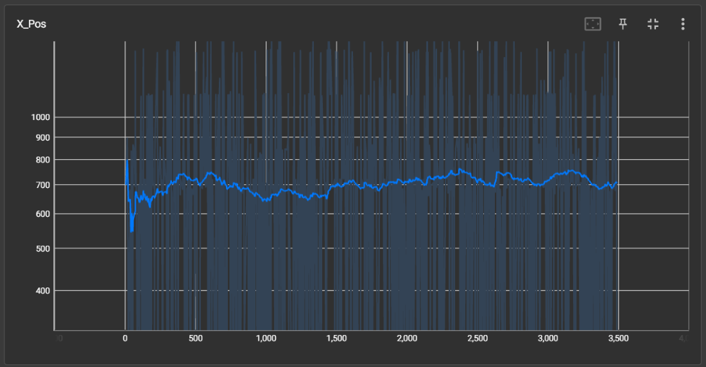
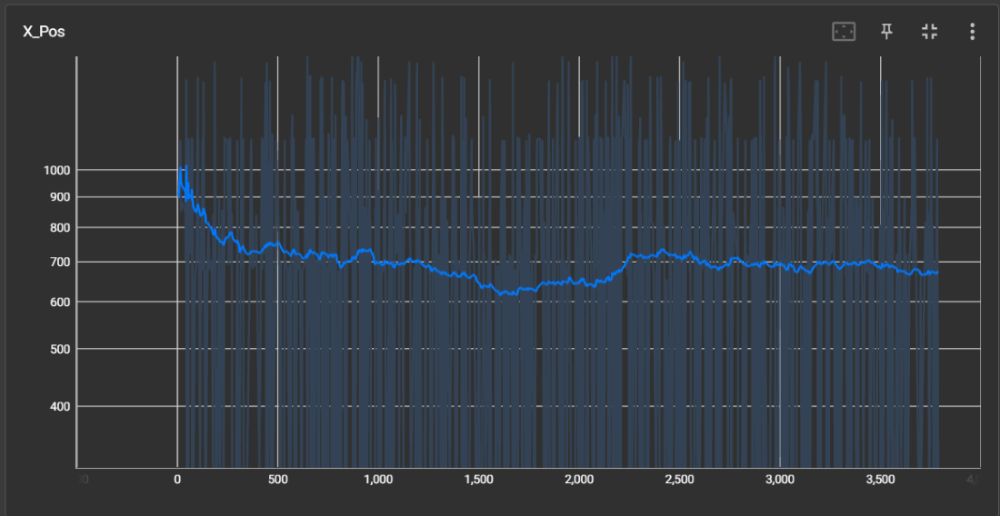
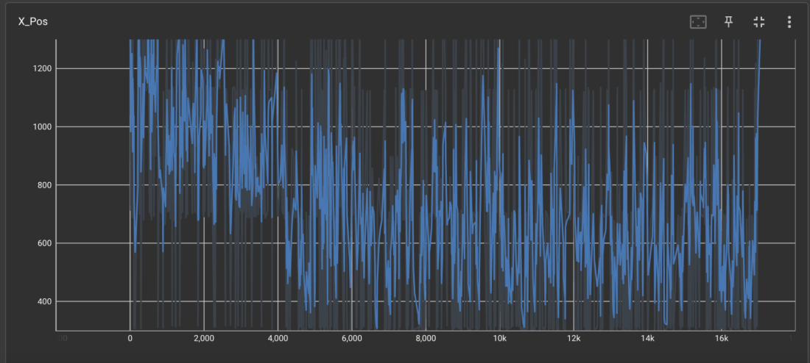

## **Video**
<iframe width="560" height="315" src="https://www.youtube.com/embed/9qgFF9UP53k?mute=1" frameborder="0" allow="accelerometer; autoplay; clipboard-write; encrypted-media; gyroscope; picture-in-picture" allowfullscreen></iframe>

## **Project Summary**
Using OpenAI’s Gym environment, we aimed to train a reinforcement learning agent to complete the first level of the original Super Mario Bros. To accomplish this feat, we tried multiple algorithms, such as Rainbow DQN and PPO, to compare different learning methods. We conducted extensive testing, allowing Mario to experiment for millions of lives with different inputs and rewards, and collected the results of his performance through different phases of our project. Through these results and recordings, we observed Mario’s behavior with recurring obstacles and looked for ways to improve his movement and bring him closer to the final flag.

Super Mario Bros is a complex game that allows for many different outcomes and game states, which makes it a perfect problem for an RL agent to solve. There are enemies, tall obstacles, and traps for the RL agent to learn all within the first level. Additionally, there are various things that we could choose to shape the reward system for the agent. These attributes of Super Mario Bros make it a good example of a small-scale obstacle course. A similar task on a larger scale could be navigating terrain in robotics or self-driving vehicles. Obstacle detection, in games and real life, is optimal when controlled by human intelligence due to their ability to adapt quickly to dynamic environments. However, human intelligence is fickle and dependent on well-being and many other factors. Optimizing computer-controlled movement according to scenario rules can be a breakthrough for automating tasks for consistency and safety. Learning to first optimize computer-controlled movement for a simpler environment, such as Super Mario Bros, will build up knowledge of how to guide computers to complete more significant tasks.

## **Approaches**

### <ins>Setup and Preprocessing</ins>
Each episode represents a single life in which the agent is rewarded for progressing (winning a level) and penalized for dying. Training on one life incentivizes the agent to be more cautious, leading to more deliberate learning. In addition to the baseline reward, we reward Mario for completing the level or penalize him for dying.

To optimize the environment setup for training, we limited Mario’s action space to a predefined set of simplified movement actions. The default action space in Super Mario Bros Gym is extensive, including all possible button combinations. By using SIMPLE_MOVEMENT, we reduce the number of actions to essential ones, such as moving left, right, and jumping. 

We applied the GrayScaleObservation wrapper to convert the environment’s observation from color to grayscale. This reduces the dimensionality of the input data (from three color channels to one), making training more efficient. Furthermore, we decided that color is not crucial for gameplay since edges and object shapes are more important for decision-making. We also used the ResizeObservation wrapper to optimize efficiency and scale the environment to 84x84 pixels. This resolution is sufficient for learning while significantly reducing computational load. Lastly, we implemented frame skipping, allowing the agent to select an action only once every four frames instead of every frame. This approach reduces computation by avoiding unnecessary updates since the environment does not change significantly within a few frames.

### <ins>Improvements and Development Timeline</ins>
We started by exploring the functionality of the Mario library using a naive approach. After doing some research online and following the “What RL algorithm should you pick” flowchart, we decided to start with a DQN model. After testing different epsilons, we were not achieving our goal and decided to meet with the professor for suggestions. The professor noted that DQN was no longer a state of the art model, and that there were better approaches to try. The professor also noted that our model was incredibly slow for our task, and suggested we try preprocessing. 

As a result, we decided to try PPO and Rainbow DQN, both more modern approaches. We also tried using a custom reward function to motivate Mario better (detailed in PPO), and applied it to all the models we had available (overriding the base on PPO, adding on to the base on DQN(s)). This caused our DQN agent to start winning as well. However, our reward was unstable and it seemed that when Mario had a breakthrough, he would go back to performing badly. This is most likely due to the short term memory nature of our DQN models, since they only give feedback based on the last set of actions/reward instead of a series of previous actions (although they build on each other, experiences of x->y->z is weaker than x->xy->xyz. 

In the future, we’d like to use LSTM for the agent so he better retains information and feedback from his actions. On the other hand, the PPO model has more experience collected in the stable baselines model, which explains why it performed better on average (would win more often).

**Total Approaches**: (DQN, Rainbow DQN, PPO) model * (custom / base) reward

### <ins>Naive</ins>   
One of our baseline approaches was to evaluate Mario’s performance when selecting movements randomly. In this approach, Mario makes decisions without any awareness of the environment, and each movement is chosen at random with equal probability. This method is a simple reference point to measure how well other approaches perform in comparison. 

Some advantages of this naive approach are minimal computation cost, no training required, and suitability for establishing a lower bound. Some disadvantages are inefficient movement, lack of learning or adaptation, and high failure rate.

### <ins>DQN</ins>   
<ins>Advantages/Disadvantages</ins>   
Deep Q-Networks (DQN) extend the Q-Learning algorithm by replacing the discrete Q-table with a neural network that approximates Q-values. This approach is advantageous in environments with large or continuous state spaces, such as those in Super Mario Bros within the Super Mario Gym. In these scenarios, the state space, composed of pixel-based images and complex game dynamics, makes the Q-table infeasible due to many possible states.DQN addresses this by leveraging a neural network to generalize across similar states, allowing the agent to learn from visual inputs and navigate the environment efficiently. 

One crucial benefit of using DQN in this project is its ability to handle the high-dimensional input space of Mario’s game environment, enabling the agent to make decisions based on raw image data. However, the use of deep neural networks introduces specific challenges. DQN typically requires a much larger volume of training data and interactions with the environment to converge to an optimal policy than standard Q-learning. The increased data requirement is due to the complexity of the neural network and high variability in game states. Furthermore, training deep neural networks is unstable, often leading to issues such as divergence of suboptimal policies. Techniques like experience replay and target networks are implemented to mitigate these instabilities, though they may not entirely eliminate them. Lastly, DQN is computationally more demanding than regular Q-Learning, requiring greater processing power and longer training times, making it more resource-intensive. 

<ins>Technical Details</ins>   
Optimal Policy Equation: $$π^*(s)=argamax​Q^*(s,a)$$
The optimal policy π* is a function that maps each state to the action that results in the highest Q-value.

In DQN, the agent maintains a Q-table, which maps state-action pairs to expected future rewards. 
The Bellman Equation for Q-learning is used to update these values:
$$Q(s, a) ← Q(s, a) + α [r + γ max_{a'} Q(s’, a’) - Q(s, a)]$$

r: immediate reward received after taking action a in state s
γ: a discount factor that balances immediate vs future rewards
s’: next state
a’:best action in s’
Q(s’, a’) : estimated by neural network

The Bellman Equation utilizes the Mean Squared Error (MSE) as the goal is to optimize the difference between target Q-values (r + $\gamma$ max Q(s’, a’)) and predicted Q-values (Q(s, a)).  (Luu)

$$L(θ) = \mathbb{E}[(r + γ max_{a'} Q(s’, a’; θ^-)- Q(s, a;θ))^2]$$

In the MSE, Θ− represents the target network and θ represents the parameters of the main Q-Network.

To prevent overfitting to recent experiences, we implemented an experience replay in which past interactions are stored in a memory buffer of size 5,000 and sampled in mini-batches of size 32. This allows the model to be more active in learning as it breaks the correlation between consecutive training samples. There is a target network that is updated periodically to compute more stable Q-value targets. This network should reduce divergence issues during training as it provides more stable Q-estimates.  

For the agent to explore different strategies before committing to an optimal policy, we used the epsilon-greedy strategy. The agent initially selects random actions with a probability of 1.0 to encourage exploration. Over time, the probability decreases at .995 per episode until it reaches .01, ensuring the agent shifts towards exploiting learned strategies. Of course, this parameter of probability decreasing will be tested and played around more in the future to find what works best with our agent.

The Adam optimizer optimizes the neural network with a learning rate of .001.
	Input Layer: Process flattened game state
	Hidden Layer: Size 128 -> Size 64 -> Action Space Size, using ReLu activation functions
	Output Layer: Predicts Q-values for each action

<ins>Psuedo Code</ins>
```plaintext
# Define the Neural Network (Q-Network)
Class QNetwork:
    Initialize layers (Flatten → Dense → ReLU → Dense → ReLU → Output Layer)
    
    Define forward pass:
        Return predicted Q-values for each action

# Define the MarioAgent (DQN)
Class MarioAgent:
    Initialize:
        Create Q-network and target Q-network
        Copy Q-network weights to target Q-network
        Set learning rate, discount factor (gamma), exploration rate (epsilon)
        Initialize optimizer and experience replay memory
    
    Function select_action(state):
        If random number < epsilon:
            Return a random action (exploration)
        Else:
            Predict Q-values and return action with highest Q-value (exploitation)

    Function store_experience(state, action, reward, next_state, done):
        Save experience (state, action, reward, next_state, done) in memory
    
    Function train():
        If memory has less than batch_size experiences:
            Return (do not train yet)

        Sample a batch of experiences from memory
        Extract states, actions, rewards, next states, and done flags
        
        Compute current Q-values from Q-network
        Compute target Q-values using target Q-network
        
        Compute loss (mean squared error between current and target Q-values)
        Perform gradient descent to update Q-network
        
        Reduce epsilon for less exploration over time
        Periodically copy Q-network weights to target Q-network

# Training Loop
For each episode:
    Reset environment and get initial state
    While episode is not done:
        Select action using epsilon-greedy strategy
        Execute action in the environment
        Store experience in memory
        Train Q-network using past experiences
    End episode

    If episode % checkpoint_interval == 0:
        Save model checkpoint
```
### <ins>Rainbow DQN</ins>
After running the DQN-based agent, we noticed that the DQN model has several limitations related to efficiency, stability, and learning speed. Rainbow DQN addresses these limitations by integrating several key improvements into one architecture. 

<ins>Advantages/Disadvantages</ins>   
One of Rainbow DQN's advantages over DQN is that it incorporates better exploration. Rainbow DQN provides a better exploration strategy than DQN’s epsilon greedy approach. In Super Mario Bros, environment exploration is due to the game's dynamic nature. The noisy network encourages better exploration, allowing the agent to discover more efficient strategies faster and avoid local optima often seen with epsilon greedy exploration. 

Furthermore, Rainbow DQN uses Double Q-Learning, which reduces the overestimation bias in Q-value estimation by decoupling action selection and evaluation. With Super Mario Bros, incorrect Q-value estimates can lead to unstable learning and poor decision-making. Double Q-learning helps prevent overestimation leading to more stable performance and a higher likelihood of finding effective strategies. 

With priorized experience replay, multi-step learning, and Double Q-learning, Rainbow DQN typically converges more quickly than DQN. Faster convergence means the agent can explore and learn more effectively, which leads to better performance in a few episodes. 

Some disadvantages of Rainbow DQN over DQN are that Rainbow DQN has a higher computational cost, making the training process slower. Although Rainbow DQN improves performance, it is significantly more computation-heavy, leading to longer training times. Another disadvantage is that due to the increased number of components, hyperparameter tuning becomes more difficult, which could lead to longer training and performance instability if not tuned properly. 

<ins>Technical Details</ins>   
The core architecture of Rainbow DQN combines several important improvements over traditional DQN. These include noisy linear layers, dueling network architecture, double q-learning, and multi-step learning. 

*The equation for Dueling Network:* Q(s,a)=V(s)+A(s,a)−1/ ∣A∣

The Q-values are calculated as from above, where V(s) is the state value, and A(s,a) is the advantage of taking action a in state s.

*Noisy Linear Layer Update:* weight=μ+σ⋅ϵ
During training, the noisy layers apply noise to weights and biases, where μ and σ are standard deviation parameters, and epsilon is sampled noise. 

*Experience Replay and Training Process:*
The agent stores experiences in a replay buffer and trains using min-batches swamped from the buffer. The agent uses the Bellman equation to compute the target value for training. Then the training steps perform an update using the MSE loss. The target network is updated periodically in an attempt to stabilize training. 

<ins>Psuedo Code</ins>
```plaintext
Class NoisyLinear:
    Initialize:
        Set input features (in_features)
        Set output features (out_features)
        Set std_init to 0.5
        Initialize weight_mu randomly within bounds based on in_features
        Initialize weight_sigma based on std_init and in_features
        Initialize bias_mu randomly within bounds based on out_features
        Initialize bias_sigma based on std_init and out_features
        Initialize weight_epsilon and bias_epsilon with normal random values

    Reset Parameters:
        For weight_mu and weight_bias, initialize randomly with uniform distribution
        Initialize weight_sigma and bias_sigma with small values

    Reset Noise:
        Generate random noise for weight_epsilon and bias_epsilon from a normal distribution

    Forward:
        If in training mode:
            Calculate weights = weight_mu + weight_sigma * weight_epsilon
            Calculate bias = bias_mu + bias_sigma * bias_epsilon
        Else:
            Use weight_mu and bias_mu for weights and biases
        Return linear transformation using these weights and biases

Class MarioAgent:
    Initialize:
        Create q_net (Q-network) and target_q_net (target Q-network) using RainbowDQN
        Initialize optimizer (Adam) for q_net
        Set gamma, epsilon, min_epsilon, decay, and batch_size
        Initialize empty memory (deque) for storing experiences
        Set log directory and prepare TensorFlow summary writer
        Prepare CSV file for logging

    Log Reward:
        Log total_reward using TensorFlow summary (write to TensorFlow logs)

    Save Checkpoint:
        If directory doesn't exist, create it
        Save q_net's state_dict (model weights) to the specified path

    Load Checkpoint:
        If checkpoint exists:
            Load q_net and target_q_net weights from the checkpoint
        Else:
            Print error message (no checkpoint found)

    Select Action:
        If random value < epsilon:
            Select random action
        Else:
            Pass state through q_net and return action with max Q-value

    Store Experience:
        Append (state, action, reward, next_state, done) to memory buffer

    Train:
        If memory has fewer than batch_size experiences, return (skip training)
        Else:
            Randomly sample batch of experiences from memory
            Convert batch data to tensors
            Calculate predicted Q-values using q_net
            Calculate target Q-values using target_q_net (reward + gamma * next_q_value)
            Compute loss (MSE) between predicted and target Q-values
            Backpropagate the loss and update q_net weights
            Decay epsilon (exploration rate)

    Update Target Network:
        Every specified number of episodes, copy q_net's weights to target_q_net
```

```plaintext
Initialize environment (SuperMarioBros-v0)
Initialize MarioAgent (state size, action size)

For each episode from 0 to num_episodes:
    Initialize state (reset environment)
    Initialize total_reward to 0
    Initialize max_x_pos to 0

    For each timestep in the episode (up to max timesteps):
        Select action using MarioAgent (based on epsilon-greedy)
        Take action in environment, get next state, reward, done, info
        Store experience in memory
        Train MarioAgent (using stored experiences)
        Track max_x_pos from info['x_pos']

        If Mario completes level (info["flag_get"] or info["life"] < 2):
            Mark episode as done (set done = True)
            Log completion status (finished or died)

        If done, break the loop

    If episode % target_update_frequency == 0:
        Update target Q-network (copy weights from q_net to target_q_net)

    Log episode stats (total reward, completion, max_x_pos)

    Save model checkpoint

    Print stats for the current episode
```

### <ins>PPO</ins>   
Although Rainbow DQN was the model we had the highest hopes for, we also wanted to compare its performance to another model so that we wouldn’t just have random movement as a reference. For this purpose, we chose to implement a simple Proximal Policy Optimization (PPO) model from Stable-Baselines3. 

<ins>Advantages/Disadvantages</ins>   
PPO is known to have some advantages and disadvantages which would make themselves apparent. Controlled updates make training reliable, preventing drastic changes that could destabilize learning. PPO balances exploration and exploitation, which we hoped would help Mario learn optimal movement strategies, specifically around enemies and tall vertical objects. However, training can be slow and computationally expensive, requiring many episodes to achieve good performance. Additionally, PPO may struggle with long-term dependencies, making it harder for Mario to remember key patterns across levels. These would combine to form bottlenecks which we would later deal with as we began deploying training to the cluster.

<ins>Technical Details</ins>   
Stable-Baselines3’s PPO model is a policy-based reinforcement learning algorithm that balances performance and stability. It uses a clipped loss function to prevent drastic updates, making training more stable. PPO leverages Generalized Advantage Estimation (GAE) for better learning and supports parallel environments for faster training. Since it works well with high-dimensional inputs like game frames, we believed it would make a good pick for an RL Mario player. 

We started without modifying the default reward built into the action method which gets returned each time Mario makes a move. This default reward function provided by gym-super-mario-bros is calculated by taking the x-position Mario achieved, subtracting a penalty for death, and subtracting a penalty for time taken. Over time, Mario showed slow signs of improvement, and upon reviewing footage of Mario’s attempts, we noticed a few things could be improved.

One of the biggest obstacles Mario faced was jumping over tall objects. Doing so would require the RL agent to hold the jump action for a couple consecutive frames, and that just wasn’t happening often, even when adjusting the entropy coefficient to encourage exploration. 

<div style="text-align: center;">
  
  <p><em>Mario stuck on the first pipe, eventually timing out</em></p>
  <p></p> 
</div>
         
It was at this point that we decided we should make our own custom reward function. We made a wrapper to overwrite the current reward, and began adding our own input. We tried rewarding Mario for picking speedy actions, penalizing him harshly for dying, penalizing him for taking too much time, and more. This brought on a separate set of issues such as Mario for some reason repeatedly dying to the first enemy over and over (maybe to avoid a timer penalty) or Mario learning to stand still or run to the left corner to avoid a harsh death penalty.

<div style="text-align: center;">
  
  <p><em>Mario stuck on the first pipe, eventually timing out</em></p>
  <p></p>
</div>
    
We got past these issues by tweaking the reward function to check if Mario was stuck (determined by an unmoving x-position over multiple frames) and then rewarding Mario for breaking out of this state. Additionally, we spent a considerable amount of time adjusting rewards and penalties to avoid issues such as Mario learning to avoid experimenting to escape the death penalty or repeatedly running into the first enemy to avoid a timer penalty. We also noticed that removing Mario’s unnecessary actions, such as going left or not making a move, significantly improved his performance. This custom reward version of the RL agent overall performed better than the normal default Mario.

<ins>Custom Wrapper Psuedo Code</ins>
```plaintext
When the game starts (reset):
   - Set last_x and max_x to 0 (to track movement).
   - Set jump_counter to 0 (to track repeated jumps).
   - Reset the game and return the starting state.

When Mario takes a step (step function):
   - Move Mario and get updated game info.
   - Check how far Mario moved since last step (x_increase).

   - Reward movement:
     - If moving fast, give a bigger reward.
     - Otherwise, give a smaller reward.

   - If Mario is stuck (not moving forward):
     - If jumping, increase reward to encourage jumping.
     - If not jumping, give a penalty.

   - If Mario reaches the flag (wins the level):
     - Reward him based on how quickly he finished.
     - Reward him with a flat substantial reward.
     - Mark the episode as done.
     - Log that he finished.

   - If Mario dies:
     - Give a big penalty.
     - Mark the episode as done.
     - Log that he died.

   - Update tracking info (max distance reached and last position).
   - Return the updated game state, adjusted reward, and status.

Logging function (log_x_pos):
   - Save Mario's progress (episode number, event type, and position) in a file.
```

### <ins>Model Comparison Summary</ins>   
**DQN**   
Advantages: Handles high-dimensional input.   
Disadvantages: Heavy compute, requires a large dataset, and can be unstable.   

**Rainbow DQN**   
Advantages: Better exploration due to noisy networks, and improved stability over DQN.   
Disadvantages: Even slower and requires heavier compute than DQN. Hyperparameter tuning is difficult, which can lead to longer training and potential instability.   

**PPO**   
Advantages: Balanced exploration and exploitation, reliable training.   
Disadvantages: Slow and requires heavy compute. Struggles with long-term dependencies.   
   
## **Evaluation**
We ran three different models, DQN, Rainbow DQN, and PPO. Since rewards differ per model (PPO’s reward completely overwrote the original reward function, whereas the DQNs added onto the previous reward, and having models with base and custom reward), we cannot directly compare model performance by reward. Instead, we compared general model performance via its ability to finish or progress through the level. To do this, we compare the trend of wins/episodes and maximum X position for each agent.

DQN Base: 0.001% (1 win)   
DQN Custom: 0.05% (5 wins)   
Rainbow DQN Base: 0 (furthest X: 2043)   
PPO Base: 0.25%   
PPO Custom: 0.5%    

Besides just using data, we also observed Mario’s videos to debug and determine what code or components were causing Mario to be incorrectly motivated to develop bad behaviors, in order to guide him in the correct direction.

### <ins>DQN</ins>   
Our inital model.

*Qualitative Evaluation:*   
An example of this is observed when the agent encounters a double pipe obstacle and repeatedly walks into the pipe. Before this behavior begins (as tracked by our video recording system), Mario manages to make it over and die to Goombas. We hypothesize that DQN refuses to move due to its association of jumping to certain death to goombas on the other end. Due to heavily penealizing this correct behavior, Mario stalls at the pipe. We correctly adjust this in the reward function by penealizing Mario for staying in one X position for too long.

*Quantitative Evaluation:*  

<div style="text-align: center;">
  
  <p><em>Base</em></p>
  <p></p>
  
  
  <p><em>Custom</em></p>
  <p></p> 
</div>

### <ins>Rainbow DQN</ins>  
Despite showing promise early in training, Rainbow DQN has not yet fully completed an entire level, but the maximum x-position reached was 2043 pixels (2/3rds of the level). However, when compared to the DQN model, Rainbow DQN exhibits a more strategic approach in gameplay. Instead of blindly advancing and jumping continuously (a behavior often observed in DQN), Rainbow DQN learns to navigate obstacles more efficiently. 

*Qualitative Evaluation:*   
An example of this is observed when the agent encounters a double pipe obstacle. Instead of repeatedly walking into the pipe / small jumping forward (as DQN does), Rainbow DQN figures out that slightly moving backwards allows him to avoid goombas while giving him enough space to jump over the pipes successfully. Additionally, Rainbow DQN demonstrates improved goomba avoidance strategies. Unlike DQN, which frequently reactsively spams jumps, Rainbow DQN learns to use blocks in the air to navigate obstacles more efficiently, which makes its jumps more efficient and avoids unnecessary actions. 

<div style="text-align: center;">
  
  <p><em>Mario Using Blocks to Avoid Goombas and Later Using it Jump Off to Pass Double Pipe.</em></p>
  <p></p> <!-- This adds a line break by creating an empty paragraph -->
</div>

*Quantitative Evaluation:*   

At the beginning of training, we observe high x-position values, which suggest that Rainbow DQN initially learns efficient movement strategies, allowing Mario to advance through the levels successfully. However, as training progressed, we noticed increased erratic movements and lower x-position values. This suggests that Rainbow DQN struggles to maintain its earlier performance. 
This can be caused by the agent having over-relied on initial success patterns and struggles when new, more complex obstacles appear (a pitfall). 

For this evaluation, default hyperparameters were used, which may not be optimal for this specific environment. These default settings could limit Rainbow DQN’s performance, particularly in later training states. To enhance performance for future references, we could modify the neural network architecture, which can result in improved feature extraction for better decision-making. We can also tune hyperparameters such as learning rate and buffer size to improve stability. Lastly, fine-tuning reward shaping can help with long-term playing and sustain Mario's progress instead of regression. Overall, Rainbow DQN demonstrates early success in learning effective movement, but it struggles with long-term consistency. 

<div style="text-align: center;">
  
  <p><em>Default - episodes vs x-position</em></p>
  <p></p>
</div>

### <ins>PPO</ins>   
Ultimately, creating a custom reward function and overwriting the default function proved to be noticeably effective.

*Qualitative Evaluation:*   
See PPO Technical Details section.

*Quantitative Evaluation:*    
<div style="text-align: center;">
  
  <p><em>Base</em></p>
  <p></p> 
  
  
  <p><em>Custom</em></p>
  <p></p>
</div>

Although both graphs are quite noisy, we can see that on average, the custom function was able to achieve a slightly higher x-position than the default. This means that on average, the custom Mario model passed one or two more obstacles than its default counterpart.

Both were capable of getting rare wins, with the custom winning a little less than twice as often compared to the default, but both were not super consistent in this endeavor. If we had more time, we would have spent much more time training. The graphs above are after around 10 million iterations each, but we have seen from other sources that they had trained their AIs sometimes in excess of 50 million iterations, taking multiple days before they saw a competent model form. In addition, we may have also spent more time trying even more reward functions and hyperparameter tweaking after doing more research into the workings of the SB3 library.

Nonetheless, the AI was able to achieve a few victories. Here are some wins recorded for the custom reward function:

<iframe width="560" height="315" src="https://www.youtube.com/embed/fdsVGv3bH04?mute=1" frameborder="0" allow="accelerometer; autoplay; clipboard-write; encrypted-media; gyroscope; picture-in-picture" allowfullscreen></iframe> <iframe width="560" height="315" src="https://www.youtube.com/embed/AKWKaFjYOks?mute=1" frameborder="0" allow="accelerometer; autoplay; clipboard-write; encrypted-media; gyroscope; picture-in-picture" allowfullscreen></iframe>

## **References**
Some of the resources we used include official documentation from OpenAI on their Gym environment as well as various random StackOverflow pages from other users who have run into similar issues as us.
* https://pypi.org/project/gym-super-mario-bros/
* https://www.romhacking.net/utilities/178/ 

Luu, Q. T. (2023, April 10). Q-Learning vs. Deep Q-Learning vs. Deep Q-Network \| Baeldung on Computer Science. www.baeldung.com. https://www.baeldung.com/cs/q-learning-vs-deep-q-learning-vs-deep-q-network

“Papers with Code - Rainbow DQN Explained.” Explained \| Papers With Code, paperswithcode.com/method/rainbow-dqn. Accessed 21 Mar. 2025. 
https://stable-baselines3.readthedocs.io/en/master/modules/ppo.html


## **AI Tool Usage**
Used LLMs (ChatGPT and Grok) to troubleshoot package dependencies. 